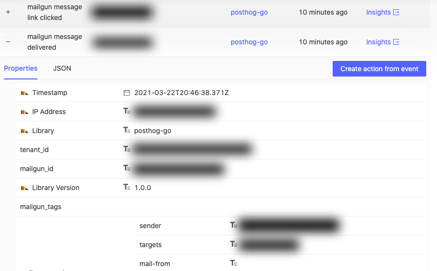
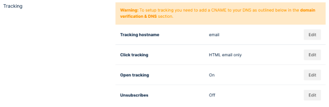
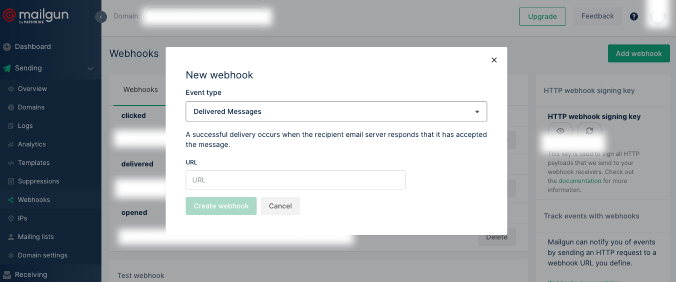

# mailgun-to-posthog

📬 A simple Google Cloud Function in Go to capture [Mailgun](https://mailgun.com/) webhook events as [PostHog](https://posthog.com/) custom events.

_This project is still under development, and it does not handle many cases. It has been tested with the Go 1.13 runtime._



---

**Why is this needed?**

This project helps you feed Mailgun events into PostHog, providing a consolidated view of your product analytics, and allowing you to understand your customers' end-to-end journey better.

For example, you may want to know the % of your customers engaging with a specific e-mail you send after an action(s). You may also be curious to know what cohort of your customers are more likely to engage versus others or what sort of events precedes the engagement.

It is extra useful for your product / engineering / design team if they do not have access to Mailgun.

**What properties are captured?**

As much as Mailgun provides. Varies depending on the event (e.g. the URL for "Clicked" event).

It can also capture additional "User Variables" specified when sending the message, see `.env.sample.yaml`.

**How does it correlate the user?**

A message is correlated with a PostHog user through a custom user ID defined in the "User Variables". You need to include this when sending the message. In Mailgun's Go SDK, you can attach the user ID like so:

```go
message.AddVariable("user_id", "user-id-123")
```

You can configure the user ID key (`user_id` by default) used, see `.env.sample.yaml`.

**What events are currently supported?**

- Delivered
- Opened
- Clicked


## Getting Started

### Prerequisites

- Ensure you have `gcloud` installed:
    - MacOS: `brew cask install google-cloud-sdk`
    - Others: https://cloud.google.com/sdk/gcloud
- Ensure you have authenticated with Google Cloud: `gcloud init`
- (Optional) Set your current working project: `gcloud config set project <project>`

### Deployment

1. Clone / download a copy of this repository
2. Copy `.env.sample.yaml` to `.env.yaml`, and modify the environment variables declared in the file
3. Run `./deploy.sh`
4. Ensure you have tracking set-up, and enabled in Mailgun, `https://app.mailgun.com/app/sending/domains/<your domain>/settings`
5. Configure Mailgun webhooks in `https://app.mailgun.com/app/sending/domains/<your domain>/webhooks`




